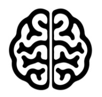
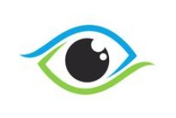

hjkhjkjhjk `gfhfg` fhgfhfhf

``` html
<head>
  <meta charset="utf-8">
  <title></title>
  <meta name="description" content="">
  <meta name="viewport" content="width=device-width, initial-scale=1">

  <meta property="og:title" content="">
  <meta property="og:type" content="">
  <meta property="og:url" content="">
  <meta property="og:image" content="">

  <link rel="manifest" href="site.webmanifest">
  <link rel="apple-touch-icon" href="icon.png">
  <!-- Place favicon.ico in the root directory -->

  <link rel="stylesheet" href="css/normalize.css">
  <link rel="stylesheet" href="css/style.css">

  <meta name="theme-color" content="#fafafa">
</head>
```

``` csharp
private void OnPropertyChanged(string propertyName)
{
   PropertyChanged?.Invoke(this, new PropertyChangedEventArgs(propertyName));
}
```

``` java
public abstract class BaseObject {
    // Coordinates
    protected double x;
    protected double y;
    // Object radius
    protected double radius;
    // Indicates whether the object is alive
    private boolean isAlive;

    public BaseObject(double x, double y, double radius) {
        this.x = x;
        this.y = y;
        this.radius = radius;
        this.isAlive = true;
    }

    public double getX() {
        return x;
    }
 }
```

Click on the image below to watch the video:
[](https://youtu.be/SWYqp7iY_Tc)

Android | iOS | Windows
------- | :-------: | ---:
Medium App for Android | Medium App for iOS | Medium App for Windows
kjdkjskal, dsdsakjk, fdsdf, asdss, fdfdf, | kjdkjskal, dsdsakjk, fdsdf, asdss, fdfdf, dfdfd, | kjdkjskal, dsdsakjk, fdsdf, asdss,vvvvvvvvvvvvv
[Play Store](https://play.google.com/store?gl=PL) | [App Store](https://www.apple.com/pl/itunes/) | [Windows Store](https://www.microsoft.com/pl-pl/store/apps)
 |  | 
 |  | 


+ [ ] task 1
+ [ ] task 2
* [ ] task 1
- [ ] task 2

1. dsddffff
   1. fffddss
      1. ddddd
   2. bnxka
2. dffffff
3444. fsdfdddf
12222f.
4. ffffour


Lot of nonsense **_nonsense_** nonsense nonsense __nonsense__ nonsense *nonsense* nonsense _nonsense_ nonsense.

> "QUOTE: Lot of **nonsense** nonsense nonsense nonsense nonsense nonsense nonsense nonsense nonsense nonsense."
 "QUOTE: Lot of **nonsense** nonsense nonsense nonsense nonsense nonsense nonsense nonsense nonsense nonsense."
 "QUOTE: Lot of **nonsense** nonsense nonsense nonsense nonsense nonsense nonsense nonsense nonsense nonsense."

~~nonsense nonsense nonsense nonsense nonsense nonsense nonsense nonsense~~
 
 # NONSENSE
 
 ## NONSENSE
 
 ### NONSENSE
  
 #### NONSENSE
   
 ##### NONSENSE
    
 ###### NONSENSE
 
 **************############

- first element
   - dfdssss
- fdsdddd
* more
   * ijhcjc
   * cdsssss
* fdfsd
+ dsasdasdas
+ ffffff
- dsadasd
- dsadasd

